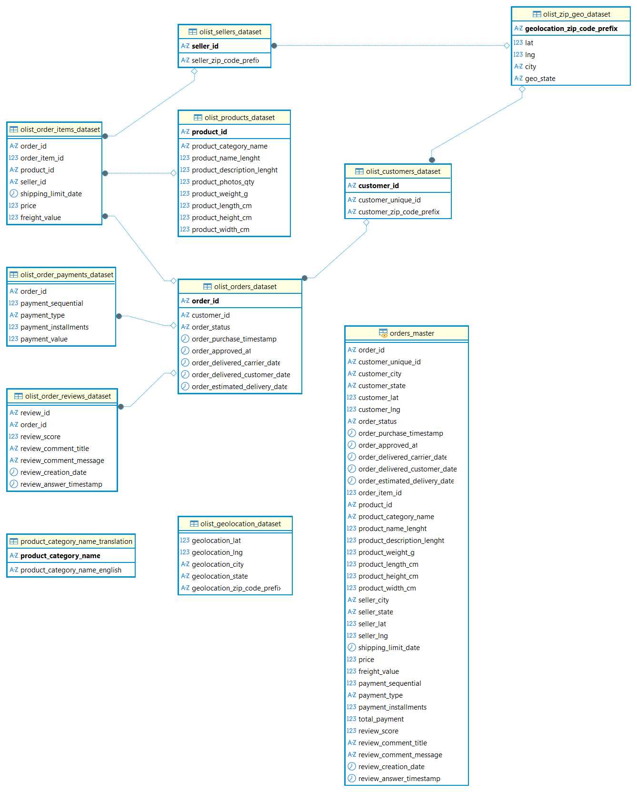
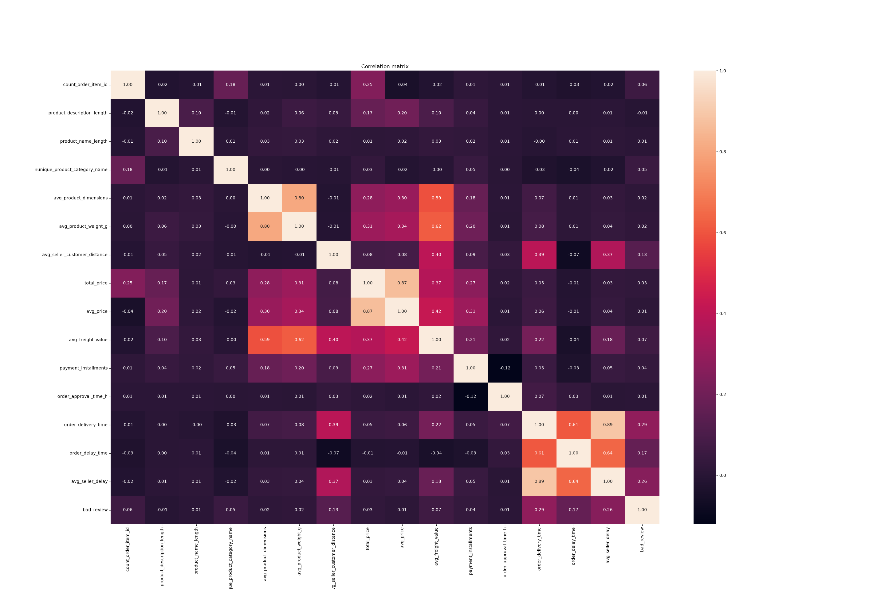
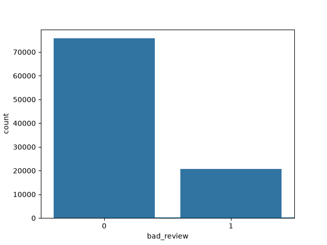

# E-commerce

## Описание
Проект по созданию нормализованной базы данных и витрины данных для задач машинного обучения на основе бразильского датасета Olist. 
Цель — подготовить данные для построения рекомендательной системы товаров. 

**Основные задачи:**
- Спроектировать нормализованную структуру БД (3НФ)
- Очистить и подготовить данные для ML-задач
- Собрать единую витрину данных с 36+ признаками
- Провести EDA
- Обучить модель классифицировать оценку заказа
- Вывести решение в production (FastAPI/Flask + Docker)


## Данные

[Датасет с Kaggle](https://www.kaggle.com/datasets/olistbr/brazilian-ecommerce/code),
бразильский E-commerce Olist, 
содержит информацию о 100 000 заказов, включая данные 
о клиентах, товарах, продавцах, отзывах и платежах и 
состоит из ключевых таблиц:
*   `olist_customers_dataset.csv`
*   `olist_orders_dataset.csv`
*   `olist_products_dataset.csv`
*   `olist_order_items_dataset.csv`
*   `olist_order_payments_dataset.csv`
*   `olist_order_reviews_dataset.csv`
*   `olist_sellers_dataset.csv`
*   `olist_geolocation_dataset.csv`:


## Структура
```
e-commerce/
├── data/ 
│   └── normalize_db.sql                   # Запросы для нормализации базы данных
├── images/                                # Графики
├── src/
│   ├── preprocessing.py                   # Предобработка данных
│   └── main.py                            # Точка входа
├── api.py                                 # Приложение
├── Dockerfile                             # Докер файл
├── requirements.txt                       # Требования
└── README.md
```

Работа была направлена на приведение данных к виду, пригодному для построения признаков. Весь процесс можно разбить на несколько логических шагов, отраженных в SQL-скриптах репозитория:

### 1. Анализ структуры и первичная нормализация
*   Проведен анализ связей между таблицами
*   Установлены первичные ключи для всех справочников (клиенты, товары, продавцы и т.д.)
*   Созданы внешние ключи для обеспечения целостности данных и явного определения связей между таблицами

### 2. Очистка и обогащение данных

- **Проблема:** почтовые индексы из таблиц клиентов и продавцов не всегда присутствуют в справочнике геолокации. Поле для связки в исходной гео-таблице не являлось уникальным.
- **Решение:** создана нормализованная таблица `olist_zip_geo_dataset`, объединяющая уникальные zip-коды из всех источников с агрегированными гео-координатами.
- **Добавлено 278 отсутствующих zip-кодов** через агрегацию координат, что позволило сохранить 100% записей без потерь.
- Выполнено приведение типов данных (VARCHAR → TIMESTAMP, NUMERIC)
- Пустые строки заменены на NULL для корректной работы SQL

### 3. Создание витрины данных для ML

Создано представление `orders_master`, объединяющее данные из 8+ таблиц в единый плоский срез.

**Итоговая витрина содержит 36+ признаков:**
- Информация о заказе (статус, даты)
- Данные клиента (гео-координаты, город, штат)
- Данные товара (категория, вес, размеры)
- Данные продавца (гео-координаты, город, штат)
- Информация о платеже (тип, сумма, рассрочка)
- Отзывы (оценка, текст, дата)

Итоговая ER-диаграмма изображена ниже



## EDA

### Заполнение пропусков
В ходе ETL-процесса было выявлено и обработано **~12% пропусков** в различных полях. Стратегия заполнения выбиралась индивидуально для каждого типа данных:

- **Даты доставки** (`order_approved_at`, 
`order_delivered_carrier_date`, `order_delivered_customer_date`, 
`order_estimated_delivery_date`) — заполнялись средним значением 
по иерархии: продавец → город продавца → штат продавца → 
глобальное среднее
- **Гео-координаты клиента** (`customer_lat`, `customer_lng`) — 
средними координатами по городу, затем по штату клиента
- **Категория товара** (`product_category_name`) — 
модальным значением по клиенту, затем по продавцу, городу и штату
- **Характеристики товара** (`product_name_lenght`, 
`product_description_lenght`, `product_weight_g`, 
`product_length_cm`, `product_height_cm`, `product_width_cm`) — 
средними значениями по продавцу, затем по городу/штату
- **Рейтинг отзыва** (`review_score`) — средним рейтингом по 
клиенту, затем по городу/штату
- **Платежи** (`total_payment`) — вычислялись как 
`freight_value + price`, остальные поля платежей заполнялись 
модальными значениями из группы заказов с плохими отзывами

### Feature engineering

Созданы дополнительные фичи для улучшения качества модели:

- `order_approval_time_h` — время одобрения заказа (часы)
- `order_delivery_time` — общее время доставки (дни)
- `order_delay_time` — задержка доставки (дни)
- `seller_delay` — задержка продавца (дни)
- `seller_customer_distance` — расстояние между продавцом и клиентом (км)
- `product_dimensions` — объем товара
- `delivery_review_time` — время до отзыва
- `has_review_message` — наличие текста в отзыве

### Кодирование признаков

- **One-Hot Encoding** для категориальных признаков с небольшим числом уникальных значений (payment_type, seller_state, customer_state)
- **Frequency Encoding** для признаков с большим числом категорий (customer_city, seller_city, product_category)

### Визуализация

- Построена корреляционная матрица признаков

- Визуализировано распределение целевой переменной (дисбаланс классов)


## Обучение модели

- Целевая переменная: `bad_review` (1 - отзыв ниже 4, 0 - отзыв 4 или выше)
- Модель: логистическая регрессия с L2-регуляризацией
- Подбор гиперпараметров: GridSearch (C, penalty, solver)
- Валидация: кросс-валидация (5 фолдов)
- Результат: ROC-AUC = 0.71 на кросс-валидации
- Дисбаланс классов: учтен через `class_weight='balanced'`

## Планы

- Добавить модель для сравнения
- Провести A/B tests
- Разработать API (FastAPI/Flask) для получения рекомендаций
- Упаковать решение в Docker